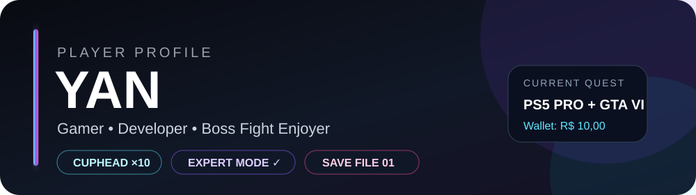
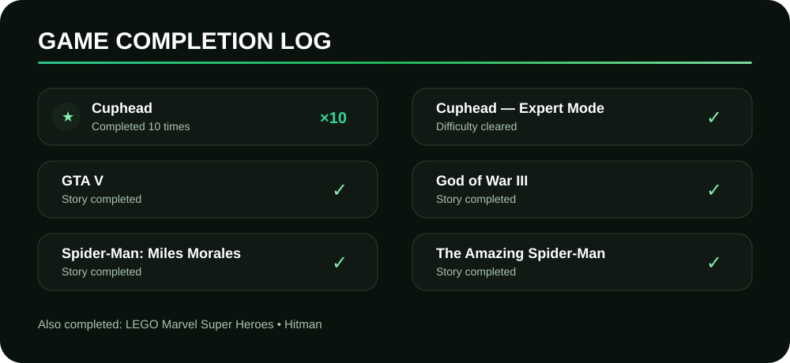
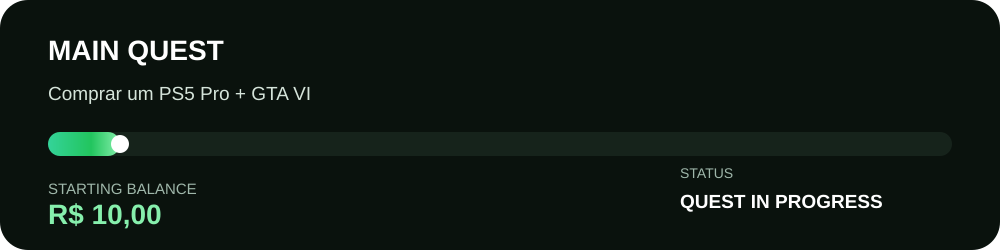

<div align="center">



<br>

<a href="https://github.com/Yanpi1/Yanpi1/stargazers">
  
</a>
&nbsp;


</div>

<br>

## 🎮 Player Overview

Sou o **Yan**. Gosto de jogos, tecnologia e de criar meus próprios projetos.

Meu histórico gamer tem um detalhe importante: **Cuphead já foi zerado 10 vezes**, incluindo uma conclusão no **modo Expert**.

<br>



<br>



<br>

## 🏆 Trophy Cabinet

<table>
<tr>
<td width="50%">

### ☕ Ten Times?!
**Cuphead ×10**

Zerar uma vez não foi suficiente.

</td>
<td width="50%">

### 💀 No More Easy Mode
**Cuphead — Expert**

Modo Expert concluído.

</td>
</tr>

<tr>
<td width="50%">

### ⚔️ Ghost of Sparta
**God of War III**

Campanha concluída.

</td>
<td width="50%">

### 🕷️ Friendly Neighborhood
**Spider-Man**

Miles Morales + The Amazing Spider-Man concluídos.

</td>
</tr>
</table>

<br>

## 💻 Developer Side

Além dos jogos, curto desenvolver aplicativos, testar ideias e aprender cada vez mais sobre programação.

```text
BUILDING  ███████░░░
LEARNING  ████████░░
DEBUGGING ██████████
GAMING    ██████████
```

<br>

<details>
<summary><b>📚 Ver todos os jogos concluídos</b></summary>

<br>

- Cuphead — **10x**
- Cuphead — **Expert Mode**
- LEGO Marvel Super Heroes
- GTA V
- God of War III
- Hitman
- Spider-Man: Miles Morales
- The Amazing Spider-Man

</details>

<br>

<div align="center">

### ♥ LIKE THIS PROFILE?

Clique no contador de **LIKES** no topo e dê uma ⭐ no repositório.

<sub>As estrelas do repositório funcionam como o contador de likes do perfil.</sub>

<br><br>

`PLAYER ONE — YAN`

</div>
