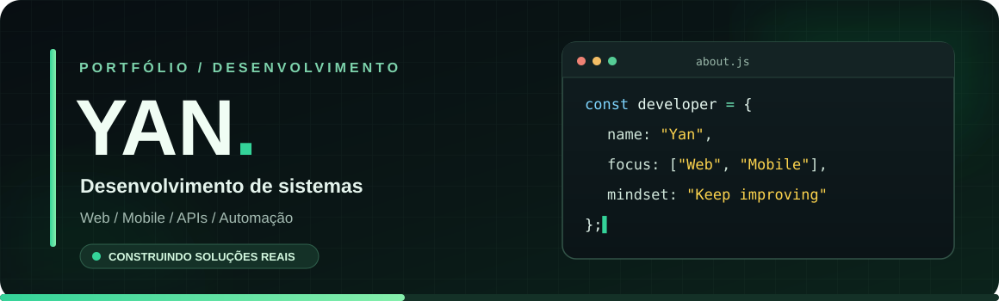
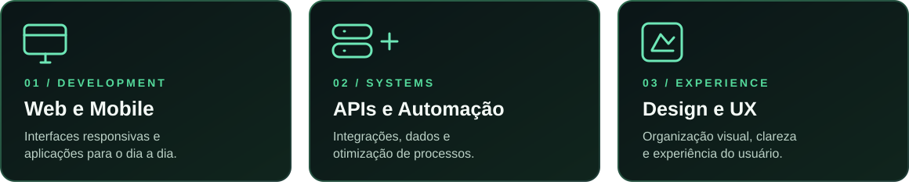

 

## Sobre mim

Sou **Yan**, desenvolvedor de sistemas interessado em criar produtos digitais que unam **funcionalidade, organização e experiência do usuário**.

Tenho interesse especial em aplicações **web e mobile**, integração de **APIs**, **automação de processos** e melhoria contínua de interfaces. Minha experiência com criação visual e edição também influencia o cuidado que tenho com os detalhes de cada projeto.

Busco evoluir tecnicamente construindo soluções práticas, estudando novas ferramentas e aperfeiçoando o código a cada versão.

## Áreas de interesse

## Tecnologias e ferramentas

Ferramentas com as quais trabalho, estudo ou desenvolvo projetos. Sempre aprendendo e experimentando novas soluções.

## Projetos em desenvolvimento

<table>
  <tr>
    <td width="50%" valign="top">
      <h3>ASCEND</h3>
      
Projeto de aplicação para loja, com foco em evolução da interface, integração entre front-end e back-end, adaptação para dispositivos móveis e recursos de assistência com IA.

      
<strong>Foco:</strong> Web · Mobile · Experiência do usuário

    </td>
    <td width="50%" valign="top">
      <h3>Capta Imóveis</h3>
      
Sistema para organizar captações imobiliárias, centralizar fichas e arquivos e explorar formas de automatizar etapas de pesquisa e cadastro.

      
<strong>Foco:</strong> Sistemas · Dados · Automação

    </td>
  </tr>
</table>

## Como gosto de desenvolver

- **Clareza:** interfaces intuitivas e funcionalidades que resolvam problemas reais.
- **Organização:** código legível, componentes reaproveitáveis e estrutura que facilite evoluções.
- **Qualidade:** atenção à responsividade, aos testes e à correção de defeitos.
- **Evolução contínua:** aprender, testar, medir e melhorar cada implementação.

---

**Tecnologia com propósito. Projetos em constante evolução.**

<a href="https://github.com/Yanpi1?tab=repositories">Conheça meus repositórios →</a>

Feito com atenção aos detalhes.

